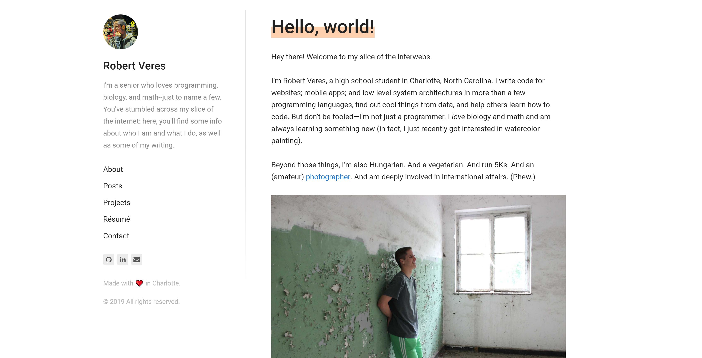

Hey there! If you're reading this, it means you've reached my new website.

*The new look*

**In short, it was time for an upgrade.** The last version of my porfolio page was significantly outdated, and the humongous picture of me in Times Square at the top didn't make it any better. But the move from old to new isn't doesn't only touch the aesthetic realm--no, it's a reflection of my changing skillset and my exposure to new technologies and influences.

For some context, the [previous version](https://github.com/thedeveloper733/RobertVeres.com_2017_2018) of my website was a raw HTML/CSS page with some basic JavaScript (mostly jQuery) hosted on Google App Engine. At the time, this was the only deployment platform I knew how to use (thanks to Steve Huffman's awsome web development course)--and, for the time being, it served its purpose. But since then, I've gone far beyond simply knowing HTML tags and CSS selectors. In 2018 and 2019 (so far), I dived into the world of front-end frameworks such as Angular and React, giving me the opportunity to make much more dynamic websites that quickly grew in complexity.

**In many ways, the evolution of my skills as a programmer led to the design you see now**. This website is pretty much entirely in JavaScript and React using [Gatsby](https://www.gatsbyjs.org/)--an awesome tool for creating static websites with an amazing community backing it. And, instead of hosting on Google App Engine, my website is now hosted on [Netlify](https://www.netlify.com/)--another fairly new technology that makes deploying websites with Gatsby a breeze. Now, I don't have to deal with individually deploying each version--I can simply push to the main git repo and see my website update automatically.

So this website is a reflection of my expanding skillset--cool. But what's in it for you, the reader? Well, a lot, actually. Because updating this site is so easy, I can add new content much more frequently in the form of posts and project updates. I'll go into some brief detail about each right now.

**Over on the [posts](/posts/) page, you'll find some articles discussing my thoughts on a variety of subjects**, such as my musings on the state of software development or new technologies that have caught my mind. Additionally, you'll find some **updates on what I'm working on** at the moment.

Meanwhile, over **on the [projects](/projects/) page, you'll find a list of everything I am or have been working on**. Most projects will have a GitHub page linked, and some will have short write-up detailing some aspects of the development process. I'll do my best to keep this as up-to-date as I can.

Alright, that's enough for now. I'll be updating this website as needed, but if you happen to spot any bugs, don't hesitate to reach out to me on the [contact](/contact/) page.

Szia! (That's bye in Hungarian!)