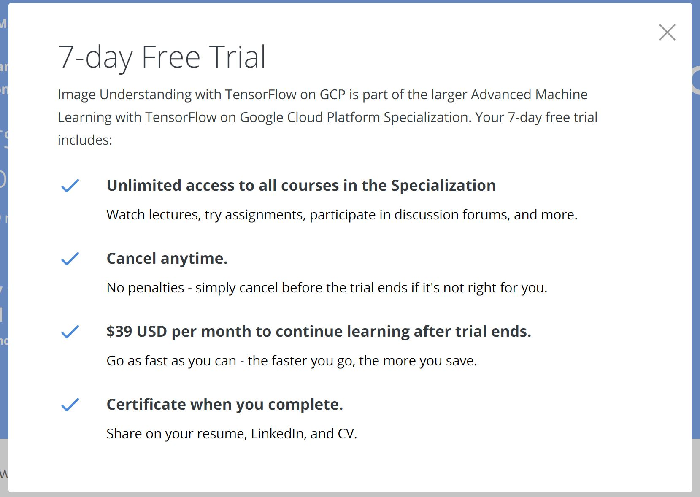
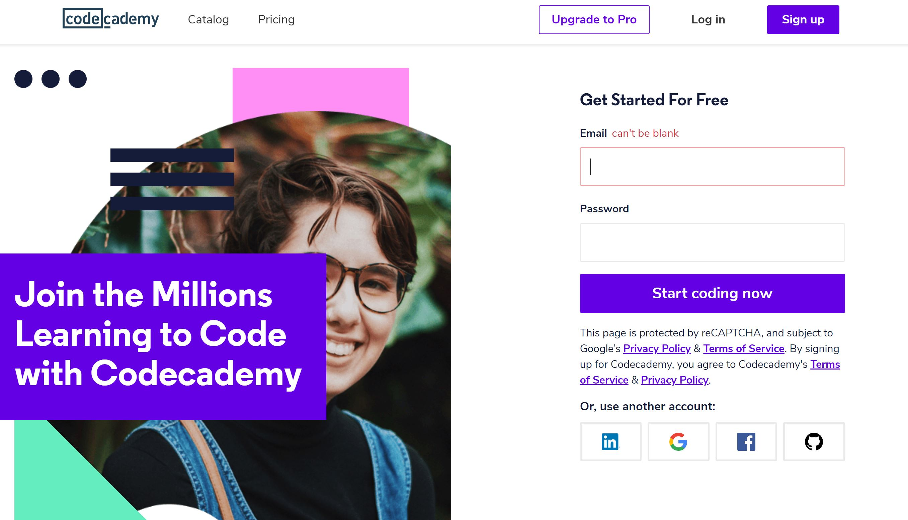
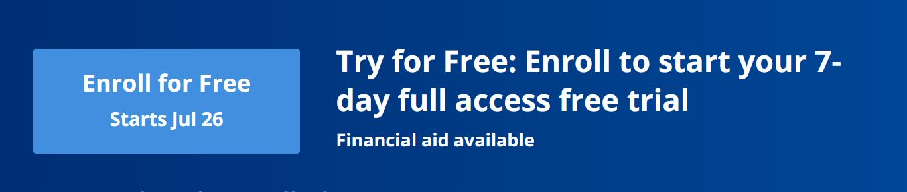
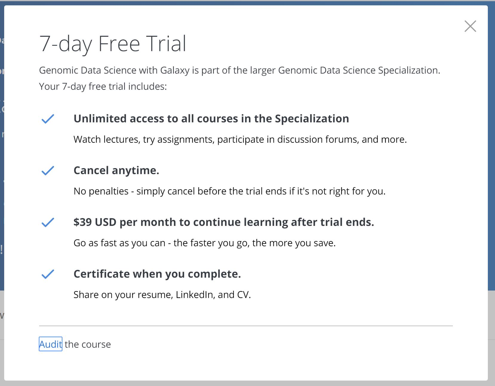

Hi all. It's time for a new post. And unfortunately, this one is more alarming than it is celebratory.

Since sixth grade, I've been continuously learning about new programming languages and skills. That means **I've seen a lot of programming education websites evolve over the years, and the trends I've noticed aren't necessarily for the better.** A few years ago, websites like Udacity, Coursera, and Codecademy were focused around providing top-notch programming education for free. Of course, many of them had paid versions of their educational offerings that offered, among other things, better support and more individualized feedback. **But their primary business was offering programming education for free--and it showed. Unfortunately, that doesn't seem to be the case anymore.**

A lot of the learning I've been doing recently has been related to TensorFlow and other machine learning products for deploying Artificial Intelligence algorithms to production-ready systems. So a few weeks ago, I found a course on Coursera about deploying AI algorithms and data mining on the Google Cloud Platform. I was ready to get started and just about to hit the blue "Enroll" button, but when I did, I was confronted with a message telling me that I could only get a trial of the course for free.

*The trial dialog I was confronted with*

In one word, it was a bummer. But it reminded me of a trend I'd been seeing for years now. For a summary, just look at Udacity's front page. When I signed up for my first Udacity course in 2016, Udacity's front page featured its free courses just as much--if not more--than its paid programs. But now (mid-2019 as of this writing), there's not a mention of free courses on Udacity's front page other than those hidden in the footer. Instead, the front page is full of advertisements for its paid features.

And it's not only Udacity. I learned my first programming language on Codecademy, and, at the time, their free courses were an invaluable resource to programmers young and old, just like me. Their home page featured stories of students and their successes--all thanks to their free education. But now, their front page describes the shift in attitude better than I can.

*Count the number of times you see "Pro" or "Pricing"--and that's just the top of the page. (Copyright 2019 Codecademy.)*

**It's a worrying shift. No longer do these programming education websites seem to be motivated to provide courses for aspiring learners. Instead, they cater to enterprise customers that pay big bucks for their content.**

Now don't get me wrong. **I understand that there is a need for a paid version of these products.** I'm no outsider to high hosting costs, which are only the beginning for these organizations. And of course, you can still access these websites' free content with some digging. But there's a difference between offering a paid version and shoving it in your users' faces every time they visit your website and try to visit a course. Don't believe me? Just take a look at Coursera's course sign-up flow.

*It doesn't really look like you're enrolling for free.*

That "Enroll" button is not even it. Once you hit it, you're confronted with a dialog that again makes it look like you have to pay to take the course.

*Again, it doesn't really look like there's a free option here.*

To enroll for free, you have to hit the tiny "Audit" link at the bottom of the dialog. I'm not a fan of this sign-up process, to say the least.

I've said it, and I'll say it again: this is a worrying trend. Luckily, at least for now, a lot of great content is still free and publicly available--but it's getting harder and harder to find it. **I guess this is only motivation to learn faster.**

That's it for now. I've got some blog posts on Machine Learning coming up that I hope you'll like.

Viszontlátásra.
