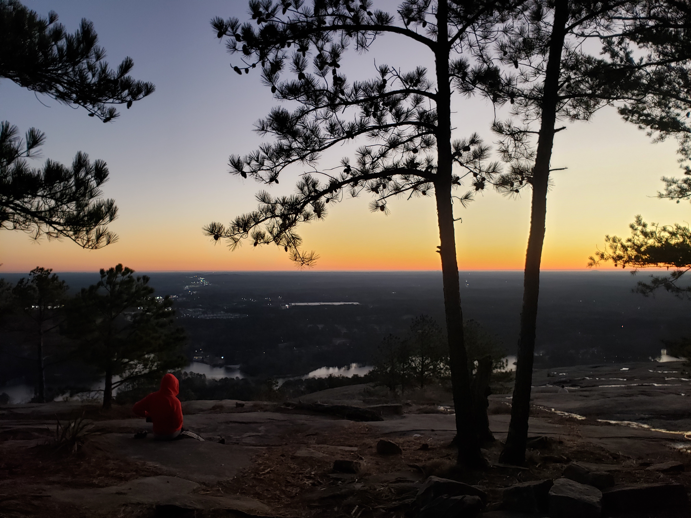

Hey there! Welcome to my slice of the interwebs.

I'm Robert Veres, a high school student in Charlotte, North Carolina. I write code for websites; mobile apps; and low-level system architectures in more than a few programming languages, find out cool things from data, and help others learn how to code. But don't be fooled--I'm not just a programmer. I *love* biology and math and am always learning something new (in fact, I just recently got interested in watercolor painting).

Beyond those things, I'm also Hungarian. And a vegetarian. And run 5Ks. And an (amateur) [photographer](https://www.flickr.com/photos/152383209@N08/). And am deeply involved in international affairs. (Phew.)

*That's me!*

## Robert, the programmer
Here's a little more about what I do:
* **Backend Web Development** with a variety of platforms and databases
* **Frontend Web Development** in most of the popular frameworks
* **Mobile Development** on Android and iOS with Flutter & React Native
* **Data Analysis** and **Machine Learning** using Pandas, Numpy, TensorFlow, and Keras
* **Low-Level Programming** in C and Assembly for Intel architectures